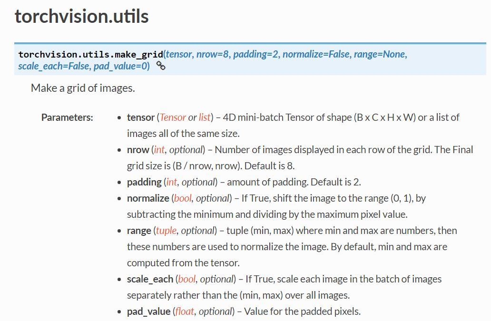

### 转载
https://github.com/Harry24k/FGSM-pytorch

### 实际上并没有给出完整的数据集

### knwledge
ImageFolder(root, transform=None, target_transform=None, loader=default_loader)
各参数含义：
root：在root指定的路径下寻找图片
transform：对PIL Image进行的转换操作，transform的输入是使用loader读取图片的返回对象
target_transform：对label的转换
loader：给定路径后如何读取图片，默认读取为RGB格式的PIL Image对象
label是按照文件夹名顺序排序后存成字典，即{类名:类序号(从0开始)}

ImageFolder读取名称带有标签的图片

iter()用来生成迭代器

make_grid()
